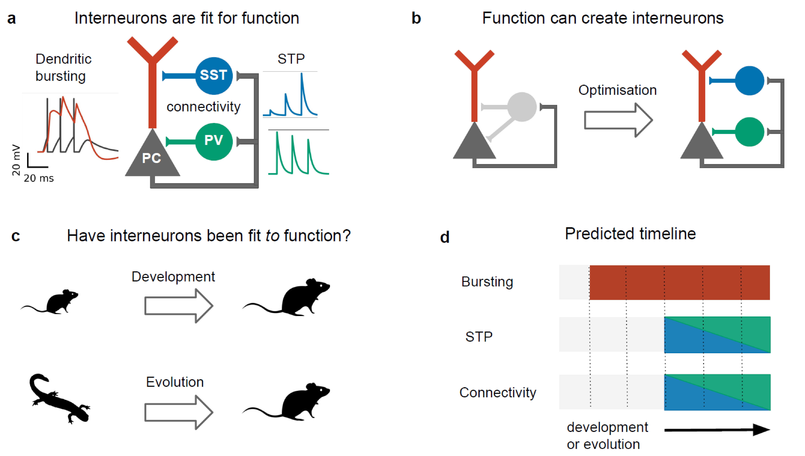

## Interneuron evolution
Analysing the evolution of cortical interneurons using single cell RNA sequencing data. This code accompanies a forthcoming paper in which we constrast an functional (or optimisation) view of interneurons with evolutionary-developmental data. 

)

## Installation

Make a copy of this repo (e.g. with git clone), cd into the root folder of the repo, and download the raw data. Then install the Python packages:

## Organization
The code is organized into the following folders:

## Analysis 

The analysis pipeline is shown in the figure below. Each step corresponds to one or several scripts. 

)

Preprocess the raw data by putting them into AnnData and Seurat files. Then run the other functions
