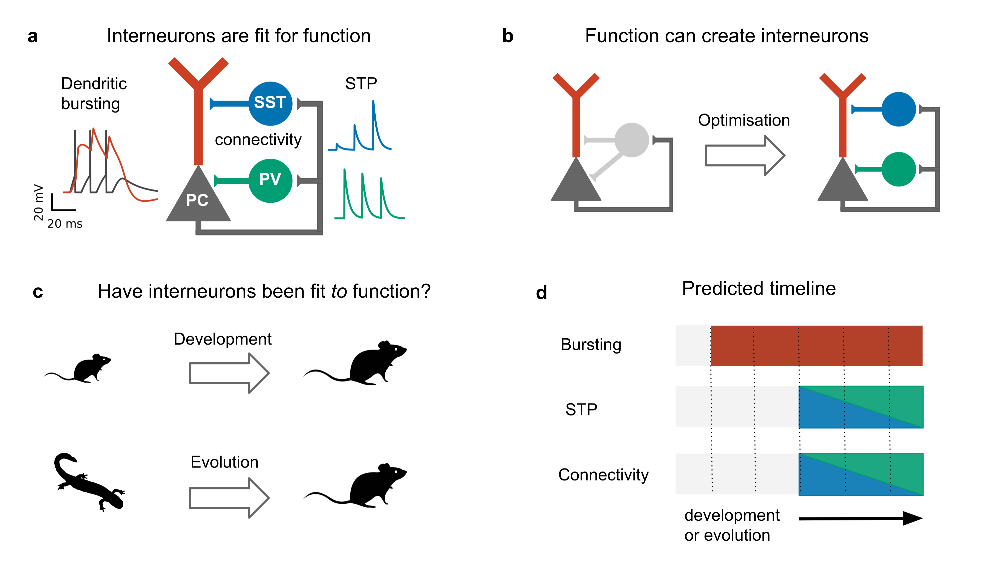
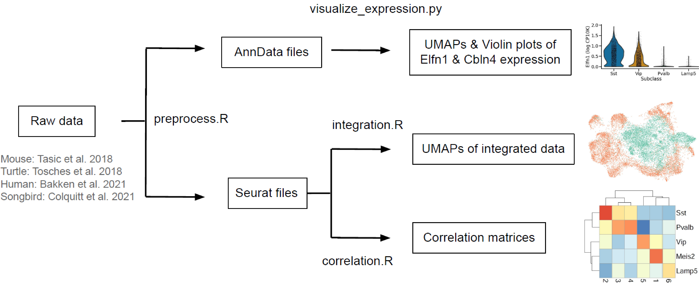

## Interneuron evolution
Analysing the evolution of cortical interneurons using single cell RNA sequencing data. This code accompanies the paper [Cortical interneurons: fit for function and fit to function?](https://doi.org/10.1101/2023.02.23.52967), in which we constrast an functional (or optimisation) view of interneurons with evolutionary-developmental data. See the [elfn1_reconstruction repo](https://github.com/JoramKeijser/elfn1_reconstruction) for the ancestral protein reconstruction. 



## Requirements
This code was developed and tested in Ubuntu 22.04.1 and 22.04.3. Running the code requires 64GB of RAM. 

## Installation

Clone this repository:
```
git clone https://github.com/JoramKeijser/elfn1_evolution/
```
Recreate the conda environment to install the required Python and R packages/libraries. 
```
cd elfn1_evolution
conda env create --name elfn1_env --file environment.yml
```
Install the project:
```
pip install -e .
```

## Organization
The code is organized into the following folders:

- `scripts` contains scripts that run the analyses
- `src` contains the code that is shared by several scripts
- `data` will contain the data after running download_data.sh (see Installation above)
- `figures` contains the figures
- `results` contains text files 
 
## Analysis 

The analysis pipeline is shown in the figure below. Each step corresponds to one or several scripts. 



Still from within the repo directory, and download the data:
```
cd elfn1_evolution
./scripts/download_data.sh
```
Run the entire pipeline:
```
./scripts/run_pipeline.sh
``` 
